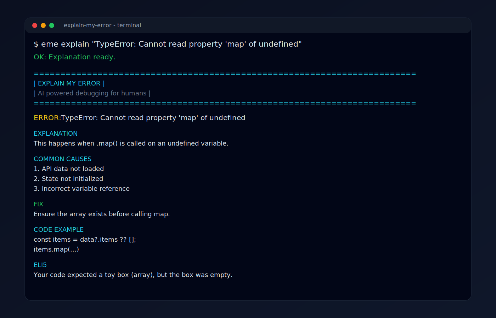

# explain-my-error



Turn confusing programming errors into clear fixes directly in your terminal.

`explain-my-error` returns:

- A plain-English explanation
- Common root causes
- A practical fix
- A code example
- An ELI5 summary

Alias included: `eme`

## Install

Install in a project:

```bash
npm i explain-my-error
```

Install globally (recommended for CLI usage from anywhere):

```bash
npm i -g explain-my-error
```

## Set your API key

Required: `GROQ_API_KEY`

macOS/Linux (zsh/bash):

```bash
export GROQ_API_KEY="your_groq_api_key"
```

Windows PowerShell:

```powershell
$env:GROQ_API_KEY="your_groq_api_key"
```

## Usage

### Interactive mode

```bash
explain-my-error
```

```bash
eme
```

### Inline message

```bash
explain-my-error explain "TypeError: Cannot read property 'map' of undefined"
```

```bash
eme explain "ReferenceError: x is not defined"
```

### Piped input

```bash
cat error.txt | explain-my-error
```

```bash
npm run build 2>&1 | eme
```

## Command reference

```bash
explain-my-error [command]
```

Commands:

- `explain [error...]` Explain a programming error
- `--help` Show CLI help
- `--version` Show CLI version


## Example output

```text
========================================================================
| EXPLAIN MY ERROR                                                     |
| AI powered debugging for humans                                      |
========================================================================

ERROR: TypeError: Cannot read property 'map' of undefined

------------------------------------------------------------------------
EXPLANATION
This happens when .map() is called on a variable that is undefined.
------------------------------------------------------------------------

------------------------------------------------------------------------
COMMON CAUSES
1. API data not loaded
2. State not initialized
3. Incorrect variable reference
------------------------------------------------------------------------

FIX
Ensure the array exists before calling map.

------------------------------------------------------------------------
CODE EXAMPLE
const items = data?.items ?? [];
items.map(...)
------------------------------------------------------------------------

------------------------------------------------------------------------
ELI5
Your code expected a box of toys (an array), but the toy box was empty.
------------------------------------------------------------------------
```

## Open Agent Skill

- Skill spec: `skills/SKILL.md`
- Skill function: `runExplainErrorSkill(input)`
